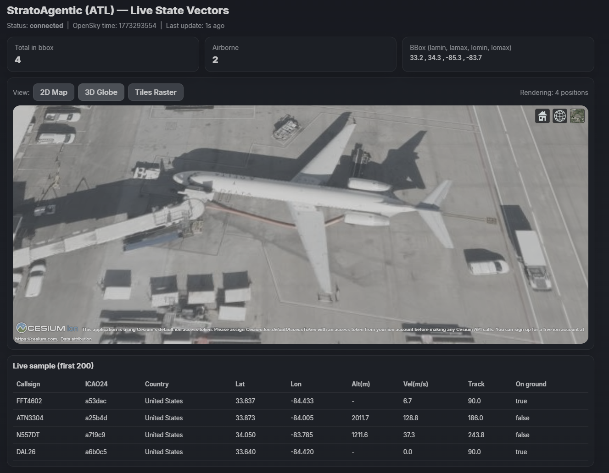
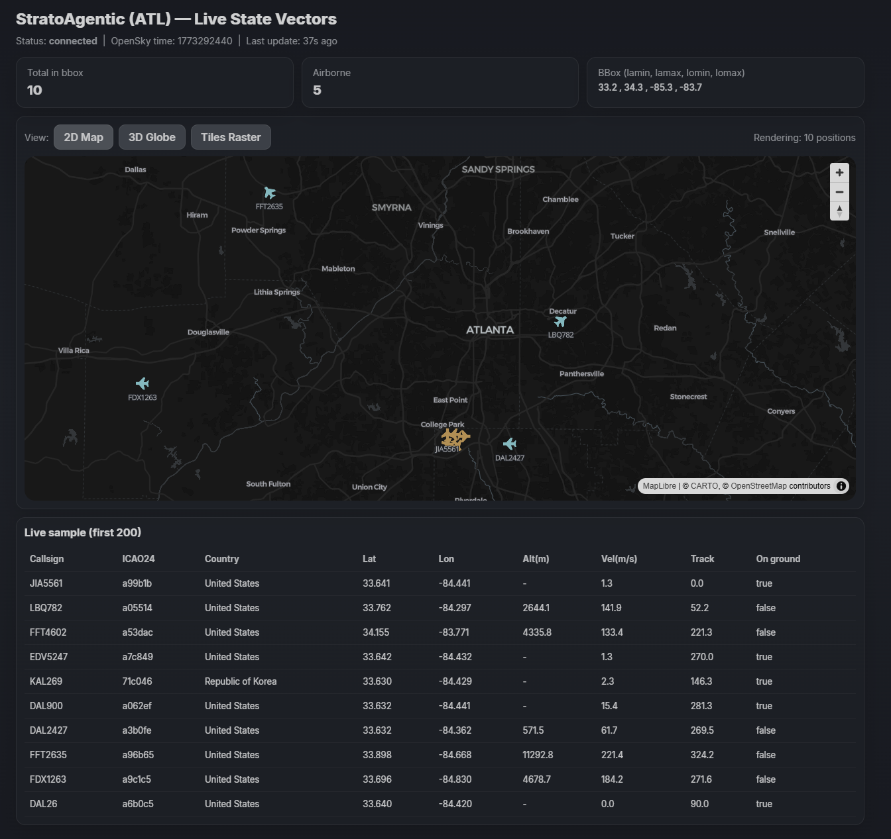
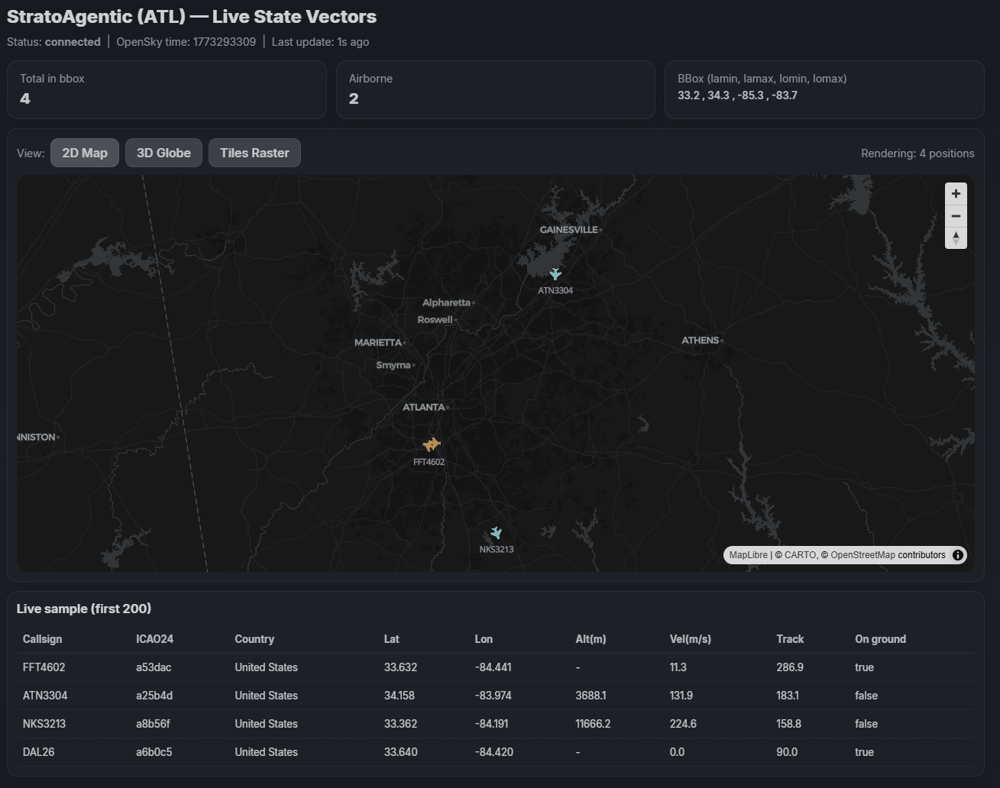
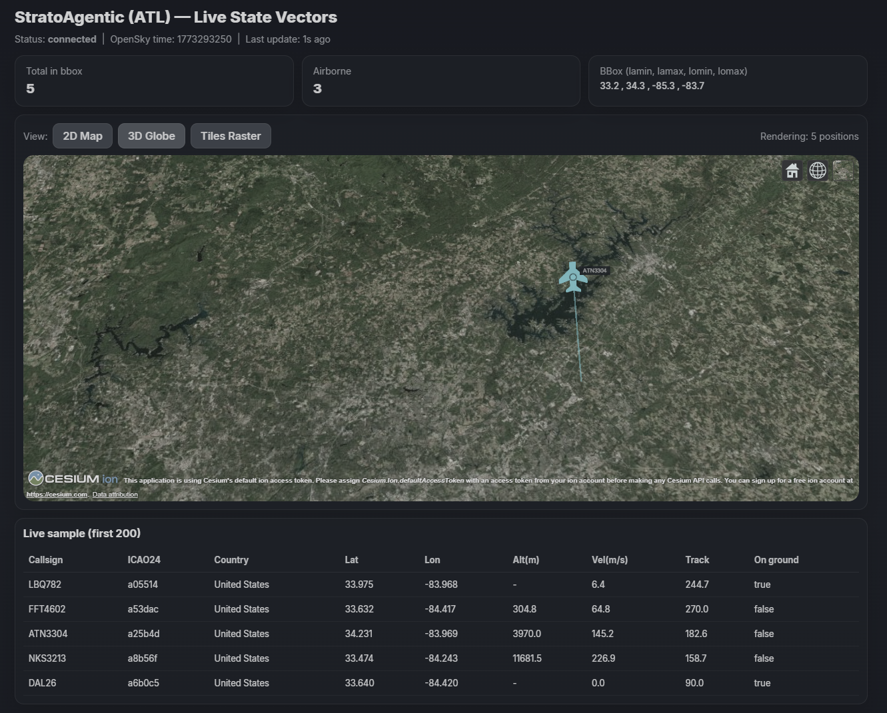
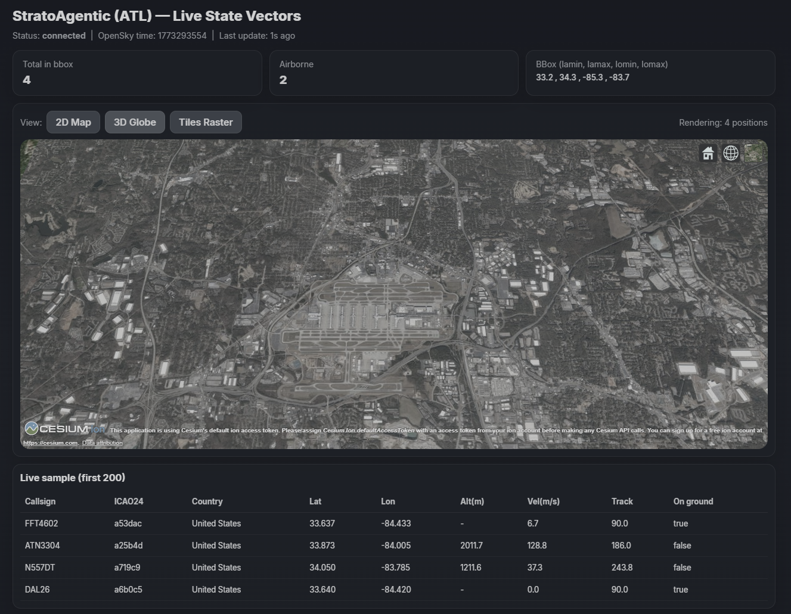
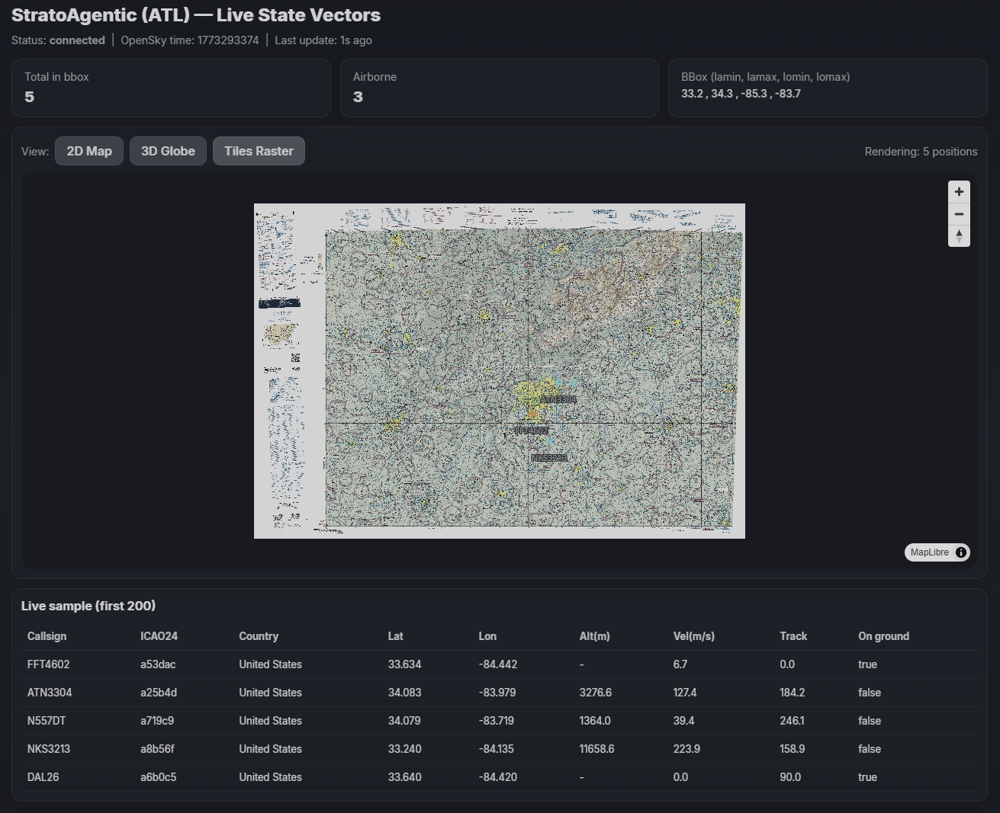
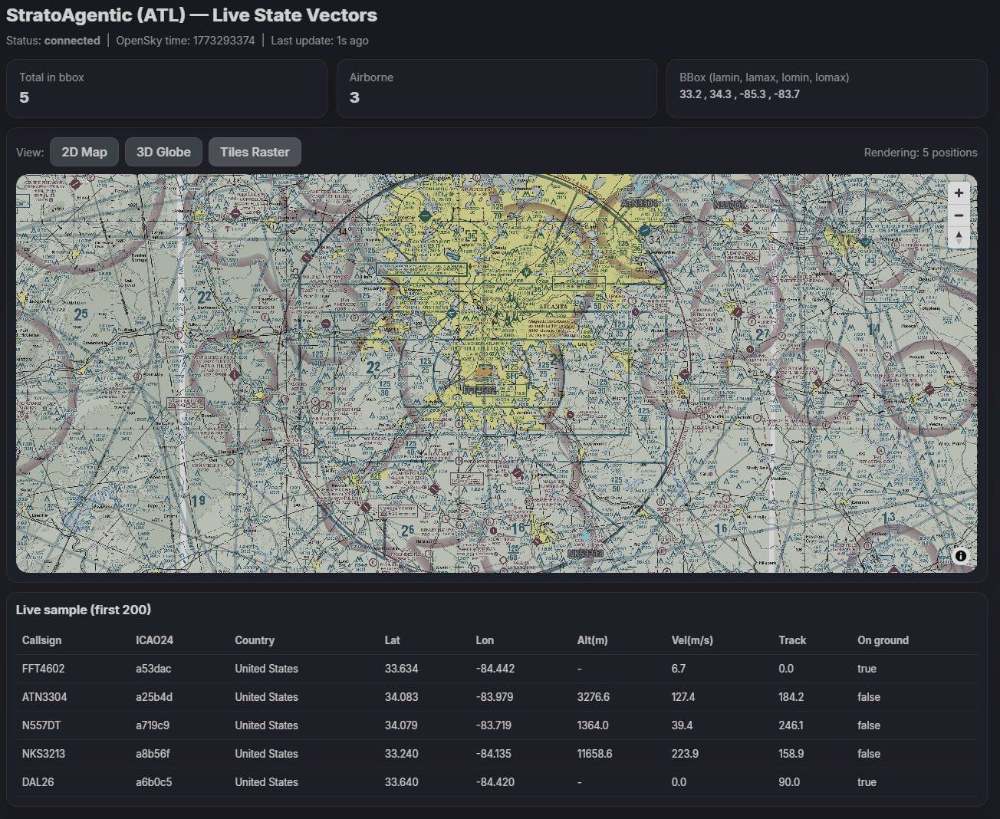
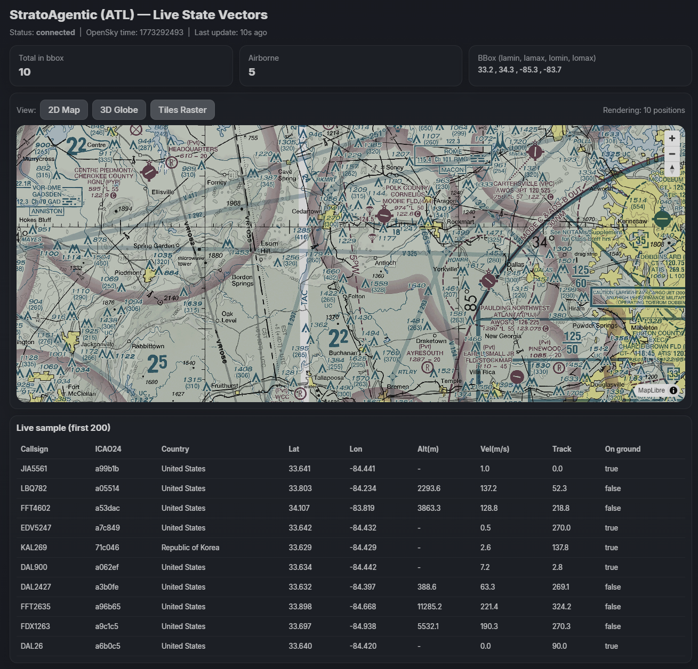
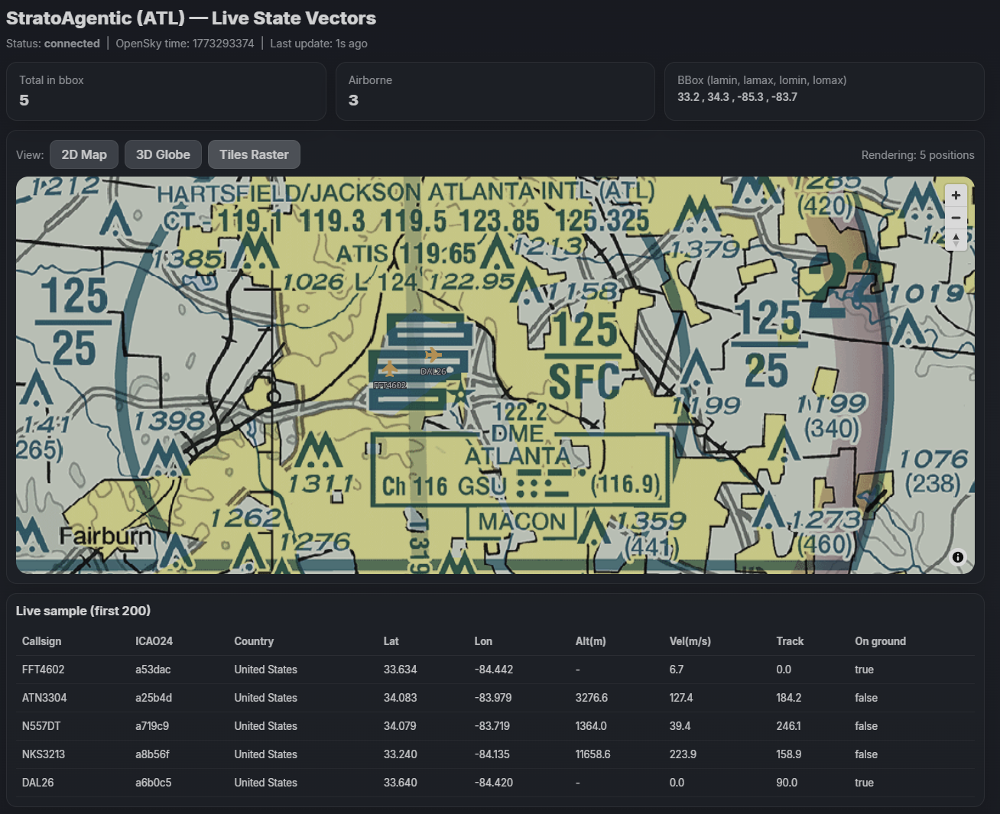

# StratoAgentic



**StratoAgentic** is a geospatial visualization prototype for monitoring aircraft telemetry within a defined airspace region near **Atlanta Hartsfield–Jackson International Airport (ATL)**


It demonstrates a hybrid geospatial rendering architecture combining:

• vector telemetry overlays
• 3D globe visualization
• server-preprocessed raster imagery
• real-time aircraft streaming

The system shows how heterogeneous geospatial data sources can be integrated into a unified visualization pipeline

It also showcases a basic starting point for:

-   **AOI-scoped data streaming**
-   **Zoom-gated rendering on a 3D globe**
-   **Real-time telemetry ingestion**
-   **Server-side geospatial APIs**
-   **3D geospatial visualization using Cesium**

The application renders aircraft activity near **Atlanta
Hartsfield--Jackson International Airport (ATL)** on a 3D globe using
**Cesium**, with **Go backend** to aggregate and normalise flight
telemetry data

This project is a **portfolio demonstration for geospatial
infrastructure engineering** of how to efficiently visualise 
distributed telemetry systems via modern web and cloud-native tooling

------------------------------------------------------------------------

# Architecture Overview

StratoAgentic comprises full stack:

- AOI-scoped telemetry ingestion
- real-time aircraft state streaming
- altitude-aware 2D and 3D visualization
- raster tile overlay workflows
- client-side geospatial rendering with modern web tooling
- backend API + WebSocket delivery
- C++ raster tiling as a preprocessing stage for imagery overlays

The project is a **portfolio geospatial infrastructure and visualization demo** showing how flight telemetry and raster data can be ingested, normalized, streamed, and rendered 

---

## High Level Application Overview

StratoAgentic currently includes **three primary frontend views**:

1. **2D Map**
   - MapLibre-based live aircraft view
   - aircraft icon rotation based on heading
   - callsign labels
   - automatic initial fit to the active flight extent

## 2D Map Vew Screenshots





Live aircraft telemetry rendered over a dark MapLibre base map
Aircraft icons rotate according to heading and display callsign labels

2. **3D Globe**
   - Cesium globe rendering
   - altitude-aware aircraft placement
   - short forward heading rays instead of looping arcs
   - initial camera fit to the active aircraft cluster

## 3D Globe View Screenshots - Increasing Zoom in Cesium Viewer






Aircraft rendered on a Cesium globe with altitude-aware positioning and heading rays representing current flight direction

3. **Tiles Raster**
   - raster tile overlay view
   - server-served raster tile index + tile images
   - aircraft icons rendered above raster imagery
   - useful for demonstrating imagery overlays and preprocessing workflows

## Raster View Screenshots









Server-preprocessed raster tiles (FAA sectional chart) generated by a C++ raster tiler and served by the backend - Aircraft telemetry is rendered on top of the raster imagery

---

## Data Sources

This project uses publicly available aviation data from the following sources:

### OpenSky Network
Aircraft telemetry is provided by the OpenSky Network.

https://opensky-network.org/

### FAA Aeronautical Charts

Raster imagery used in the **Tiles Raster** view is derived from FAA VFR sectional charts.

Source:  
Federal Aviation Administration (FAA) Aeronautical Information Services

https://www.faa.gov/air_traffic/flight_info/aeronav/digital_products/vfr/

Specifically:

Atlanta Sectional Chart  
FAA Aeronautical Chart

FAA charts are public domain works of the United States Government.

---

## Key capabilities demonstrated

- **OpenSky telemetry ingestion** through a Go backend
- **WebSocket streaming** of normalized snapshots to the frontend
- **React + TypeScript** frontend with Webpack
- **MapLibre GL** for 2D rendering
- **CesiumJS** for 3D globe rendering
- **Font Awesome SVG-to-data-URL icons** for aircraft markers
- **Smoothed aircraft interpolation** between snapshot updates
- **Raster tile serving** from backend-hosted preprocessed imagery
- **C++ raster tiling workflow** for slicing source imagery into map-aligned tiles

---

## Architecture overview

```text
OpenSky API
    │
    ├── web/        # React + Webpack + Cesium frontend
    │
    ├── server/     # Go API service
    │
    └── README.md

## Frontend details

The frontend is built with:

- **React**
- **TypeScript**
- **Webpack**
- **CesiumJS**
- **MapLibre GL**
- **Font Awesome**

### Frontend views

#### 1. 2D Map (`Map2D.tsx`)
The 2D map renders live aircraft positions with:

- aircraft icons derived from Font Awesome SVG
- separate color treatment for airborne vs on-ground states
- callsign labels
- rotation from aircraft heading / track
- initial fit to current live aircraft extent

#### 2. 3D Globe (`Globe3D.tsx`)
The 3D globe renders:

- aircraft billboards at altitude
- labels and heading-aware rotation
- short forward heading rays for in-air aircraft
- no looping synthetic return arcs
- initial camera fly-to over the active area

#### 3. Raster view (`RasterView.tsx`)
The raster tab demonstrates:

- loading a backend-served `tile_index.json`
- mounting raster tiles as MapLibre image sources
- overlaying live aircraft on top of tiled imagery
- validating a preprocessing workflow from raw raster to browser-ready tile set

### Frontend utility files

#### `icons.ts`
Converts Font Awesome aircraft icons into SVG data URLs for use in:

- MapLibre symbol images
- Cesium billboards

#### `ws.ts`
Builds and manages the frontend WebSocket connection to the backend stream endpoint.

#### `useInterpolatedFlights.ts`
Smooths aircraft motion between snapshot updates so planes do not appear to jump from update to update.

#### `types.ts`
Contains shared frontend telemetry types including:

- `StateVector`
- `Snapshot`
- `FlightPoint`

#### `global.d.ts`
Declares webpack-injected globals such as:

- `CESIUM_BASE_URL`
- `WS_BASE_URL`

---

## Backend details

The backend is written in **Go** and is responsible for:

- polling and normalizing OpenSky data
- exposing REST endpoints for latest snapshot retrieval
- broadcasting snapshots over WebSockets
- optionally persisting data to PostgreSQL / MongoDB
- serving raster tile assets and tile metadata

### Backend responsibilities

- fetch telemetry for an ATL-area bounding box
- normalize state vectors
- cache the latest snapshot
- expose latest snapshot to the frontend
- stream updates to subscribed clients
- host raster files for the raster visualization tab

### Example backend endpoints

These may vary slightly depending on your final routing, but the frontend currently expects patterns like:

- `GET /api/health`
- `GET /api/flights/latest`
- `WS /stream`
- `GET /raster/tile_index.json`
- `GET /raster/<tile-file>`

---

## Raster preprocessing in C++

To showcase how to process raster data, there is a **C++ raster tiling workflow**

### Why this exists

Web viewers do not usually consume a single very large source raster efficiently. A preprocessing step is often needed to:

- cut the source image into manageable tiles
- preserve geospatial bounds for each tile
- generate tile metadata for frontend placement
- support overlay rendering in a performant way

### What the C++ rastering tool does

The raster tiler is intended to:

- open an input raster
- read raster dimensions and metadata
- split it into fixed-size tile images
- emit tile files
- generate a JSON index describing each tile’s geographic extent

### Typical output

A tiling run generally produces:

- a set of raster tile image files
- a `tile_index.json` describing:
  - tile filename
  - tile bounds
  - source pixel coordinates
  - width / height

That index is then read by the frontend raster tab and used to place each image tile at the correct geographic extent

### Example raster index shape

```json
{
  "tiles": [
    {
      "file": "tile_0_0.png",
      "tileX": 0,
      "tileY": 0,
      "pixelX": 0,
      "pixelY": 0,
      "width": 512,
      "height": 512,
      "minLon": -85.0,
      "minLat": 33.0,
      "maxLon": -84.5,
      "maxLat": 33.5
    }
  ]
}
```

### Example C++ component layout

```text
cpp/raster-tiler/
├── main.cpp
├── CMakeLists.txt
└── README.md
```

### Toolchain notes

A typical setup for the C++ rastering stage uses:

- **C++17 or later**
- **GDAL**
- **CMake**

A typical build flow:

```bash
cd cpp/raster-tiler
mkdir -p build
cd build
cmake ..
cmake --build .
```

A typical run:

```bash
./raster-tiler --input /path/to/source.tif --output /path/to/output-dir
```

---

## Local development setup

### Requirements

Recommended local requirements:

- **Go 1.22+**
- **Node 20+**
- **npm 10+**
- **Docker Desktop**
- **CMake**
- **GDAL** (for the C++ raster tiler)
- **A C++17-capable compiler** such as:
  - `g++`
  - `clang++`
  - MSVC

---

## Running with Docker

This is the easiest way to stand the system up locally

### From the project root

```bash
cd docker
docker compose up --build
```

### Expected services

- frontend → `http://localhost:3000`
- backend → `http://localhost:8080`
- postgres → `localhost:5432`
- mongodb → `localhost:27017`

If your compose file exposes different host ports, use those instead

---

## Running backend locally

```bash
cd backend
go run ./cmd/api/main.go
```

Expected backend base URL:

```text
http://localhost:8080
```

Useful checks:

- `http://localhost:8080/api/health`
- `http://localhost:8080/api/flights/latest`
- `http://localhost:8080/raster/tile_index.json`

---

## Running frontend locally

```bash
cd frontend
npm install
npm run dev
```

Expected frontend URL:

```text
http://localhost:3000
```

The frontend webpack dev server proxies backend calls for:

- `/api`
- `/stream`
- `/raster`

---

## Typical local startup flow

### Option A: Docker Compose
Use this if you want the simplest full-stack startup

```bash
cd docker
docker compose up --build
```

### Option B: Hybrid local development
Use this if you want faster frontend iteration

Terminal 1:
```bash
cd backend
go run ./cmd/api/main.go
```

Terminal 2:
```bash
cd frontend
npm install
npm run dev
```

Then open:

```text
http://localhost:3000
```

---

## Preparing raster assets locally

If you want the raster tab to display something meaningful, you need raster tiles and a tile index available from the backend

### Typical flow

1. Build the C++ raster tiler
2. Run it against a source raster
3. Copy the generated tiles + `tile_index.json` into the backend’s raster-serving directory
4. Start backend and frontend
5. Open the **Tiles Raster** tab

### Verify raster availability

These should resolve in a browser once the backend is serving them:

```text
http://localhost:8080/raster/tile_index.json
http://localhost:3000/raster/tile_index.json
```

If they do not, the frontend raster tab will remain blank or show an error overlay

---

## Frontend implementation notes

Recent frontend additions include:

- three-tab main page:
  - `2D Map`
  - `3D Globe`
  - `Tiles Raster`
- Font Awesome SVG-derived plane icons
- heading-aware icon rotation
- smoother plane motion with `useInterpolatedFlights.ts`
- 3D heading rays replacing looping synthetic arcs
- raster overlay loading through `RasterView.tsx`

### Why the heading ray was added
Earlier versions drew looping arcs that implied an aircraft was leaving and then returning. That was visually misleading. The current approach uses:

- aircraft icon
- altitude placement
- short forward heading ray

which better matches the available telemetry

---

## Backend implementation notes

Recent backend-side responsibilities now include:

- latest snapshot endpoint for frontend bootstrap
- WebSocket stream for live updates
- raster tile index and raster tile hosting for the raster tab
- optional database wiring for persistence experiments

---

## Troubleshooting

### Frontend builds but shows no aircraft
Check:

- backend `/api/flights/latest` returns data
- websocket `/stream` connects
- `track`, `latitude`, and `longitude` are present
- browser console has no SVG/image load errors

### Raster tab is blank
Check:

- `GET /raster/tile_index.json` works
- tile filenames in `tile_index.json` match actual files
- tile bounds are valid
- frontend webpack proxy includes `/raster`

### 3D globe shows too few aircraft
Check:

- latest snapshot actually contains aircraft in the AOI
- the globe is fitting to current points
- entities are updated rather than destroyed and recreated
- icon SVG data URLs are valid

### Plane orientation looks wrong
Remember that:

- aircraft track is typically measured clockwise from north
- icon artwork may be authored pointing east
- map/globe rotation offsets may need a `-90` degree correction

---

## Technology stack

### Frontend
- React
- TypeScript
- Webpack
- CesiumJS
- MapLibre GL
- Font Awesome

### Backend
- Go
- REST API
- WebSockets

### Optional persistence
- PostgreSQL
- MongoDB

### Raster preprocessing
- C++
- GDAL
- CMake

### Infrastructure
- Docker
- Docker Compose

---

## Motivation

StratoAgentic explores how real-time telemetry and geospatial imagery can be combined into a concise prototype that still reflects real platform concerns:

- normalization and API design
- stream delivery
- browser-side rendering choices
- icon and heading semantics
- raster preprocessing
- local reproducibility

While this prototype currently focuses on ATL-area aircraft telemetry, the same architectural pattern can support:

- UAV / drone operations
- mobility / logistics systems
- simulation visualization
- remote sensing overlays
- tactical or mission planning displays

---

## Future improvements

Potential future enhancements include:

- richer altitude color banding
- hover popups and aircraft detail panels
- true trajectory history trails
- historical playback
- 3D aircraft models
- route and airport inference
- vector tile backends
- PostGIS / GeoServer integration
- terrain-aware raster and DEM overlays
- GPU-accelerated geospatial pipelines

---

## License

This project is licensed under the **MIT License**